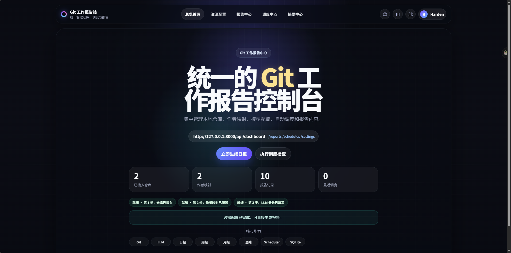
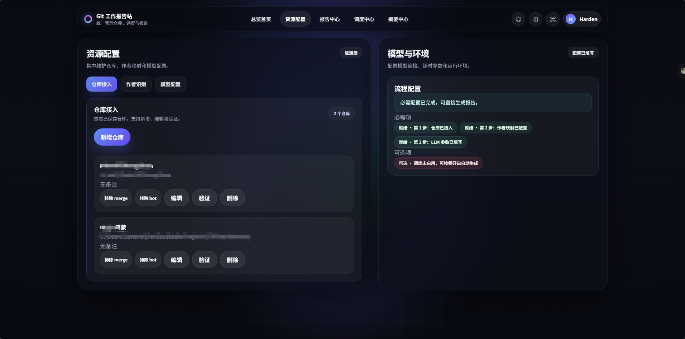
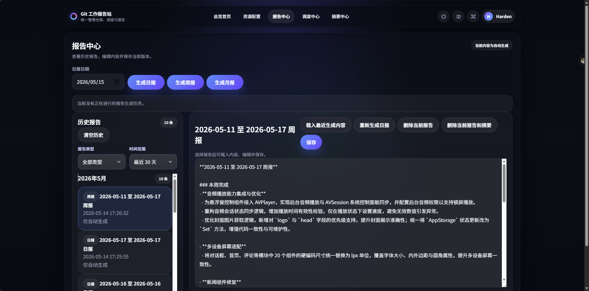

# Git Work Report Automation

一个面向个人与小团队的 Git 工作汇报自动化工具。它基于 `FastAPI + SQLite` 构建，可从多个本地 Git 仓库采集提交记录、识别个人贡献、生成提交摘要，并结合 OpenAI 兼容大模型输出日报、周报、月报和阶段性工作总结。

适合用于减少手工整理工作汇报的时间，尤其适合需要同时维护多个代码仓库、定期输出研发进展、或希望把代码改动快速整理成自然语言报告的场景。

## 功能

- 配置多个本地 git 仓库
- 为每个仓库分别配置作者姓名/邮箱映射，用于识别本人提交
- 采集指定时间范围内的 git 日志与实际代码改动内容
- 基于代码改动聚合与 OpenAI 兼容接口生成报告内容
- 在后台页面中查看、编辑、保存报告
- 支持手动生成和后台定时自动生成

## 界面预览

### 总览首页



### 资源配置



### 报告中心



## 快速开始

### 方式一：命令行启动

1. 创建虚拟环境并安装依赖：

Windows PowerShell：

```powershell
python -m venv .venv
.venv\Scripts\Activate.ps1
pip install -r requirements.txt
```

macOS Terminal：

```bash
python3 -m venv .venv
source .venv/bin/activate
pip install -r requirements.txt
```

2. 启动服务：

```bash
uvicorn app.main:app --reload
```

3. 打开浏览器访问：

`http://127.0.0.1:8000`

### 方式二：双击启动

Windows：

- 双击 [run_app.bat](run_app.bat)

macOS：

- 双击 [run_app.command](run_app.command)
- 如果首次打开被系统拦截，可在“系统设置 -> 隐私与安全性”中允许执行，或先运行：

```bash
chmod +x run_app.command
```

这两个脚本都会自动：

- 创建 `.venv` 虚拟环境
- 安装/更新依赖
- 启动 FastAPI 服务
- 自动打开浏览器到 `http://127.0.0.1:8000`

## 环境变量

- `REPORTER_DB_PATH`：SQLite 数据库路径，默认 `data/app.db`
- `REPORTER_LLM_BASE_URL`：OpenAI 兼容接口地址，如 `https://api.openai.com/v1`
- `REPORTER_LLM_MODEL`：模型名
- `REPORTER_LLM_API_KEY`：API Key
- `REPORTER_TIMEZONE`：时区，默认 `Asia/Shanghai`
- `REPORTER_LLM_REPORT_TIMEOUT_SECONDS`：日报生成超时秒数，默认 `45`
- `REPORTER_LLM_COMMIT_SUMMARY_TIMEOUT_SECONDS`：单条提交摘要生成超时秒数，默认 `30`

也可以在页面中修改 LLM 配置和调度规则。

## 说明

- 当前版本只处理本地可访问仓库，不负责自动 clone/pull。
- 当前版本面向 macOS 和 Windows 桌面环境使用。
- 若目标仓库存在 `safe.directory` 限制，页面校验与采集接口会返回错误说明。
- “选择文件夹”按钮依赖本机桌面 Python 环境；如果无法打开系统选择器，也可以直接手动填写仓库路径。
- 若未配置 LLM 或调用失败，系统会返回规则生成的兜底内容，并记录分阶段错误信息、超时信息和 prompt 规模提示。
